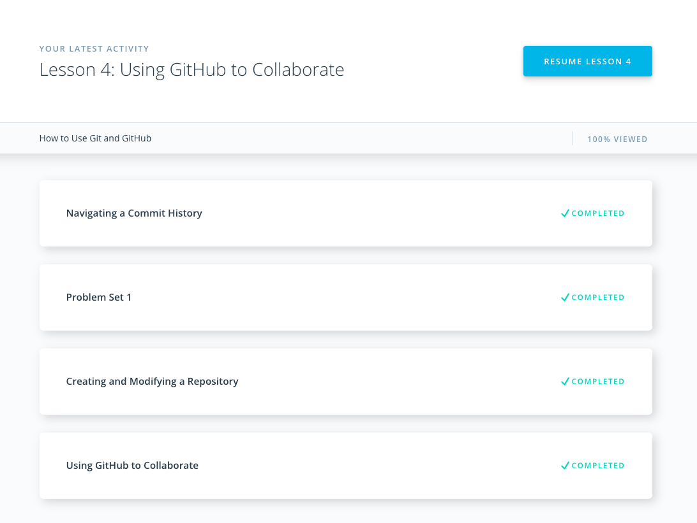
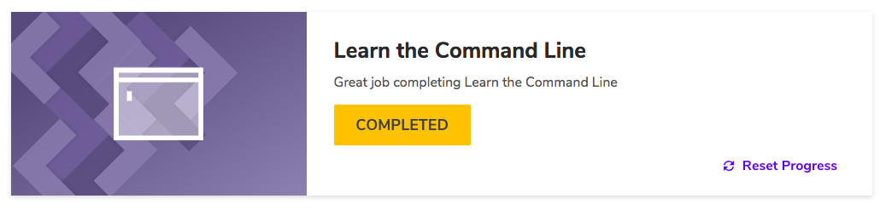
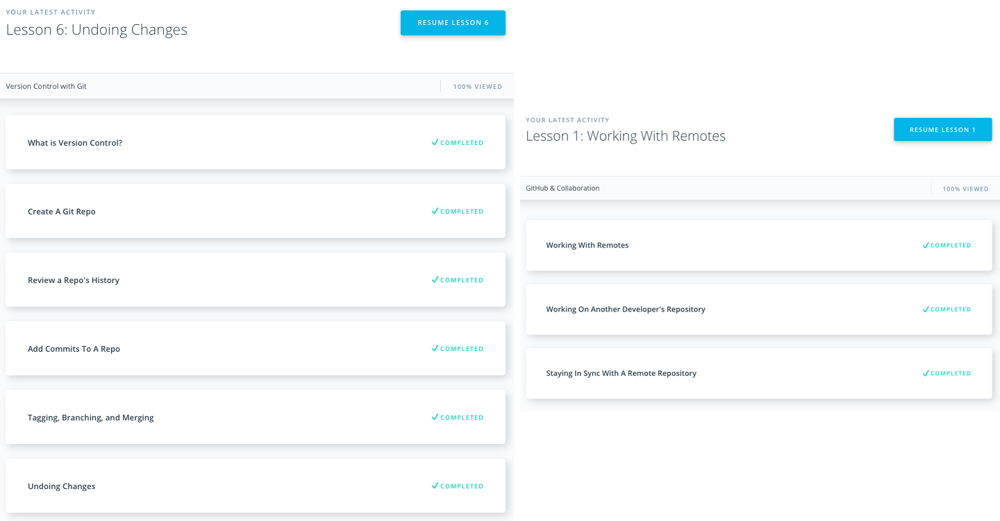
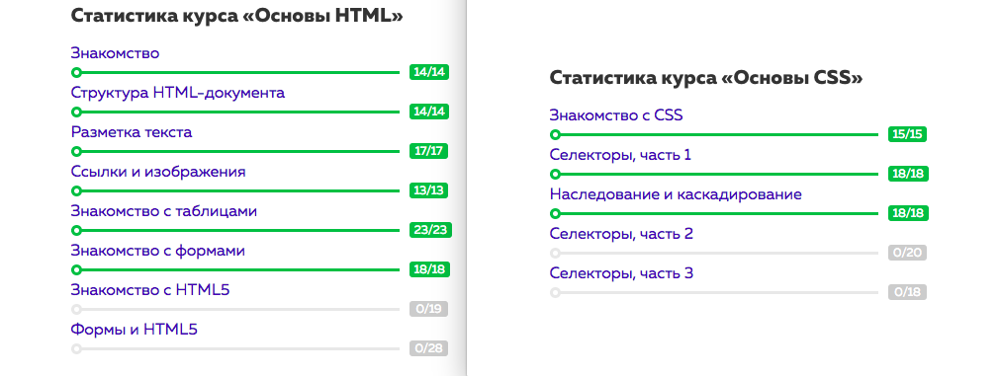
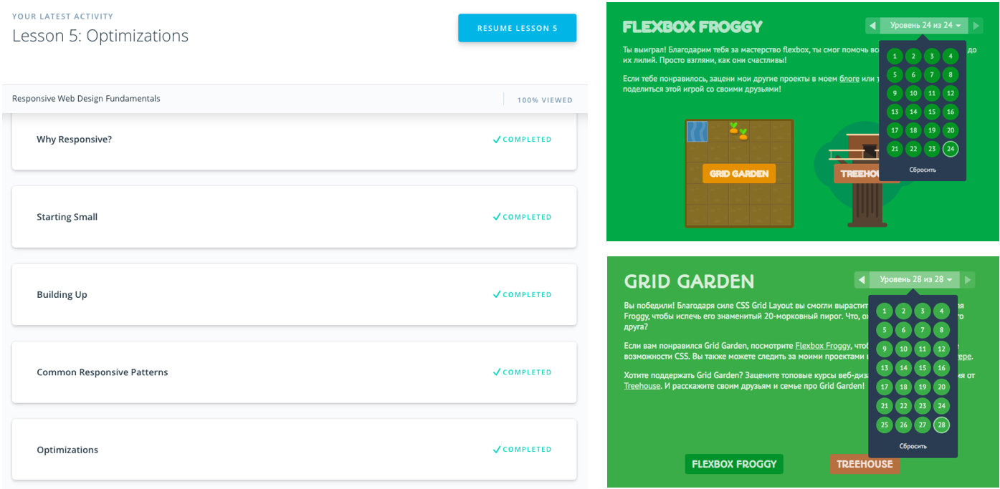
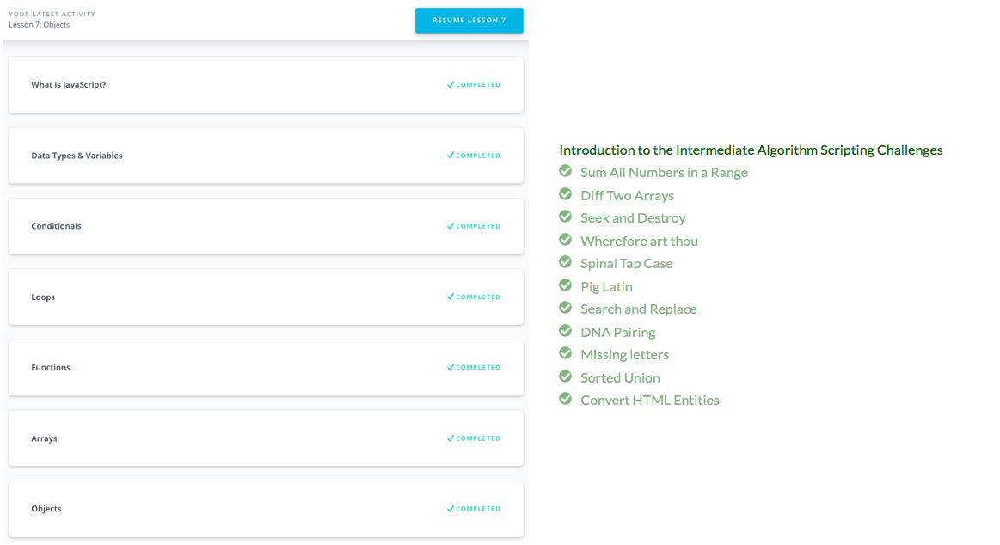
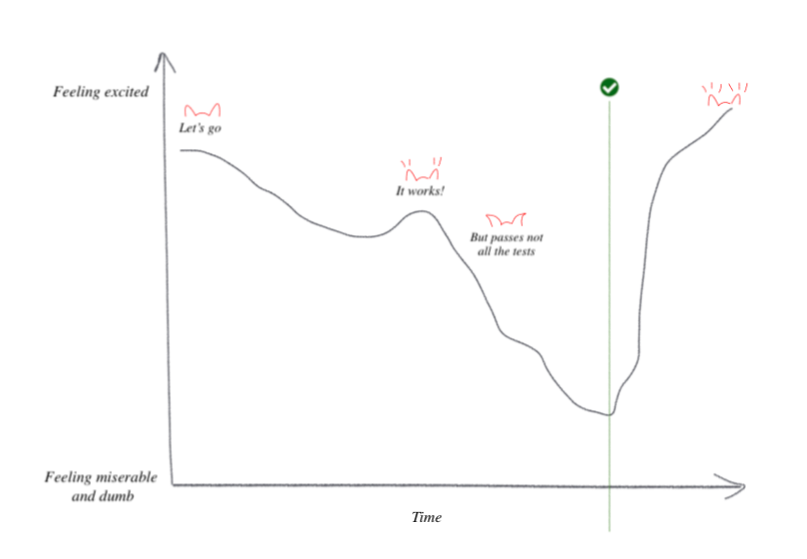

# Kottans Frontend Tasks
## Git and GitHub

Ok, I finally got familiar with Git basics. I heard about it for few years, but used for 0 years. Well, I used git clone, git init. Since last month had used commit, push and pull, but never understood how it really works. Course from Udacity, though looked too long for such topic, helped me to understand commits, branching, collaboration via forking and pull requests. Finally helped me to understand that there exists such thing as stage area and why it exists :) 

Reflections writing during the course helped to even strengthen the understanding. It's like preparing answers for the interview, but it's you who interviews youreself! Useful thing, shortly.

I also, wish that lections for the couse were even more interective and maybe had animations for different concepts, which really helps me to understand the material – _see how it work, moves visually_.

Hexlet's "Как учиться и справляться с негативными мыслями" is also very interesting in terms of combining, "zipping" many techinques for optimal thinking, that we all might have heard before and good to refresh.

## Linux, Command Line, HTTP Tools

After Udacity's courese I got knowledge about combining command options, like -alt; work of cp command, and its ability to work with multiple files, and choose files to copy with wildcards. Now I also know that move (mv) can be used to rename files. I got knowledge about input/output, rewriting and appending to files, piping with "|", commands sort, uniq and grep (wow, we can search matches in files from commandline). Also I learned sed command and it's usage for outputing results with "filter". I also learned nano text editor; how to setup aliases and variables in .bash_profile; environment variables that contain info about environment.

> Ok, i'm writing this as I watch tutors (not afterwards) and I'm gonna admit, after being spoiled with cool and practice-centered Udacity and Codecademy courses, two long Tutsplus articles are boring, have hard to understand language and generally leave nothing new on this theme in my brain. They're just a long list of technologies and their definitions (as for me). Meh. So I'll try Udacity's "Networking for Web Developers" to better understend the theme.

Ok, so Udacity’s course on Networking gave me a better understanding of work of IP, TCP and HTTP layers of network structure. I finally understand what "subnet mask" on my router means, how people are dealing with running out of ipv4s and that HTTP is just a dialogue between browser and server with magic words, handled by TCP. Each layer from Hardware>IP>TCP>HTTP gives guarantees and simple interface of control for the other layer. I’ve got familiar with cool abilities of tcpdump to catch the packages. Knowledge about how routers control speed of receiving of data or how sites deal with distiguishing many users with the same public ip address, these are also very interesting.

## Git for Team Collaboration

This course as for me mostly repeats content on first course on Git and Github, so I run though it briefly, searching for new info. Here is what I found new: `git tag`, "?" in .gitignore, `git log --oneline --graph --all`, `git commit --amend`, Relative Commit References, Reverting changes, `git shortlog`, `git rebase` isn't that scary.

I didn't understand why to put in curriculum a course which mostly repeats content of one of the previous courses, but tells it in a slightly different (as for me in a better) way. Glory to the branches' animated visualizations!

## Intro to HTML and CSS

I love HTMLAcademy (and free frontend conferences), some of their tasks are _very cute_. Especially last task in CSS. New things for me from this course, shortly: `<dl>`, `<dt>`, `<dd>`, `<del>`, `<ins>`, `<mark>`, `nth-child(2n)` and `nth-child(odd)` to choose odd children.

## Responsive Web Design

Staring from some point in the past I can't really see styling pages without flexbox. Technology already has been helping me to solve _a lot of_ the design tasks. Very universal technology, as for me. But CSS Grid has even more capabilities! (Though, I understand, that there are caseses where flexbox is more suitable). 

Course from Udacity didn't really give me much new knowledge on this theme, but Flexbox Froggy and Grid Garden were pretty interesting and challenging enough closer to their finishes.

> I'm also going through (haven't finished yet) WesBos' [course on CSS Grid](https://cssgrid.io) now. It's even more informative and dives deeper into the theme of CSS Grid (themes, like auto-fit and minmax() function)

## JavaScript Basics

Udacity course explains basics of JS pretty clear. Examples, practice and visual animations contribute to that. 

Guys, there are animations! Guys? Where did you go? Don't you like animations? They're important... Only for me? Meh..

Honestly, I run through Udacity's JS basics briefly (skipped some videos and but read and performed tasks), proudly relying on my some sort of 3-years-ago-experience from learn.javascript.com and programming labs in university. 

✨ My little discoveries:
- We can chain expressions with ternary operators (but whyfor?);
- Difference between function declarations and function expressions;
- We can store function in an object just as any other object. Why haven't I ever thought about it? It was obvious...

I performed all required freeCodeCamp tasks, though. And... didn't think I would say this but this is the most exciting part of the course. This process when you've spend 20 min for a task and feel like being close to giving up, but few minutes later you solve it and feel completely excited, and just being... winner! 
