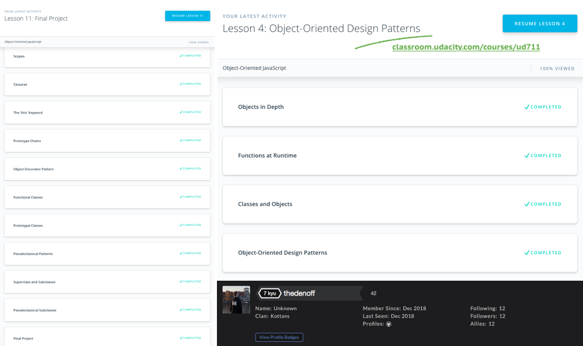

# Kottans Frontend Tasks

Contents: [Git and Github](https://github.com/denislukianenko/kottans-frontend#git-and-github) | [Linux, Command Line, HTTP Tools](https://github.com/denislukianenko/kottans-frontend#linux-command-line-http-tools) | [Git for Team Collaboration](https://github.com/denislukianenko/kottans-frontend#git-for-team-collaboration) | [Intro to HTML and CSS](https://github.com/denislukianenko/kottans-frontend#intro-to-html-and-css) | [Responsive Web Design](https://github.com/denislukianenko/kottans-frontend#responsive-web-design) | [JavaScript Basics](https://github.com/denislukianenko/kottans-frontend#javascript-basics) | [DOM](https://github.com/denislukianenko/kottans-frontend#dom) | [A Tiny JS World](https://github.com/denislukianenko/kottans-frontend#a-tiny-js-world) | [Object Oriented JS](https://github.com/denislukianenko/kottans-frontend#object-oriented-js) | [OOP Exercise](https://github.com/denislukianenko/kottans-frontend#oop-exercise) | [Offline Web Application](https://github.com/denislukianenko/kottans-frontend#offline-web-applications) | [Memory Pair Game](https://github.com/denislukianenko/kottans-frontend#memory-pair-game) | To be continued...

## Git and GitHub

Ok, I finally got familiar with Git basics. I heard about it for few years, but used for 0 years. Well, I used git clone, git init. Since last month had used commit, push and pull, but never understood how it really works. Course from Udacity, though looked too long for such topic, helped me to understand commits, branching, collaboration via forking and pull requests. Finally helped me to understand that there exists such thing as stage area and why it exists :)

Reflections writing during the course helped to even strengthen the understanding. It's like preparing answers for the interview, but it's you who interviews youreself! Useful thing, shortly.

I also, wish that lections for the couse were even more interective and maybe had animations for different concepts, which really helps me to understand the material – *see how it work, moves visually*.

Hexlet's "Как учиться и справляться с негативными мыслями" is also very interesting in terms of combining, "zipping" many techinques for optimal thinking, that we all might have heard before and good to refresh.

## Linux, Command Line, HTTP Tools

After Udacity's courese I got knowledge about combining command options, like -alt; work of cp command, and its ability to work with multiple files, and choose files to copy with wildcards. Now I also know that move (mv) can be used to rename files. I got knowledge about input/output, rewriting and appending to files, piping with "|", commands sort, uniq and grep (wow, we can search matches in files from commandline). Also I learned sed command and it's usage for outputing results with "filter". I also learned nano text editor; how to setup aliases and variables in .bash_profile; environment variables that contain info about environment.

> Ok, i'm writing this as I watch tutors (not afterwards) and I'm gonna admit, after being spoiled with cool and practice-centered Udacity and Codecademy courses, two long Tutsplus articles are boring, have hard to understand language and generally leave nothing new on this theme in my brain. They're just a long list of technologies and their definitions (as for me). Meh. So I'll try Udacity's "Networking for Web Developers" to better understend the theme.

Ok, so Udacity’s course on Networking gave me a better understanding of work of IP, TCP and HTTP layers of network structure. I finally understand what "subnet mask" on my router means, how people are dealing with running out of ipv4s and that HTTP is just a dialogue between browser and server with magic words, handled by TCP. Each layer from Hardware>IP>TCP>HTTP gives guarantees and simple interface of control for the other layer. I’ve got familiar with cool abilities of tcpdump to catch the packages. Knowledge about how routers control speed of receiving of data or how sites deal with distiguishing many users with the same public ip address, these are also very interesting.

## Git for Team Collaboration

This course as for me mostly repeats content on first course on Git and Github, so I run though it briefly, searching for new info. Here is what I found new: `git tag`, "?" in .gitignore, `git log --oneline --graph --all`, `git commit --amend`, Relative Commit References, Reverting changes, `git shortlog`, `git rebase` isn't that scary.

I didn't understand why to put in curriculum a course which mostly repeats content of one of the previous courses, but tells it in a slightly different (as for me in a better) way. Glory to the branches' animated visualizations!

## Intro to HTML and CSS

I love HTMLAcademy (and free frontend conferences), some of their tasks are _very cute_. Especially last task in CSS. New things for me from this course, shortly: `<dl>`, `<dt>`, `<dd>`, `<del>`, `<ins>`, `<mark>`, `nth-child(2n)` and `nth-child(odd)` to choose odd children.

## Responsive Web Design

Staring from some point in the past I can't really see styling pages without flexbox. Technology already has been helping me to solve _a lot of_ the design tasks. Very universal technology, as for me. But CSS Grid has even more capabilities! (Though, I understand, that there are caseses where flexbox is more suitable).

Course from Udacity didn't really give me much new knowledge on this theme, but Flexbox Froggy and Grid Garden were pretty interesting and challenging enough closer to their finishes.

> I'm also going through (haven't finished yet) WesBos' [course on CSS Grid](https://cssgrid.io) now. It's even more informative and dives deeper into the theme of CSS Grid (themes, like auto-fit and minmax() function)

## JavaScript Basics

Udacity course explains basics of JS pretty clear. Examples, practice and visual animations contribute to that.

Guys, there are animations! Guys? Where did you go? Don't you like animations? They're important... Only for me? Meh..

Honestly, I run through Udacity's JS basics briefly (skipped some videos and but read and performed tasks), proudly relying on my some sort of 3-years-ago-experience from learn.javascript.com and programming labs in university.

✨ My little discoveries:

- We can chain expressions with ternary operators (but whyfor?);
- Difference between function declarations and function expressions;
- We can store function in an object just as any other object. Why haven't I ever thought about it? It was obvious...

I performed all required freeCodeCamp tasks, though. And... didn't think I would say this but this is the most exciting part of the course. This process when you've spend 20 min for a task and feel like being close to giving up, but few minutes later you solve it and feel completely excited, and just being... winner!

## DOM

New for me from Udacity's DOM course:

- `perfomance.now()`,
- `document.createDocumentFragment()`,
- ideas on how on how to not to cause additional repaints when adding/removing multiple elements.
- stages of event listener

Some of freeCodeCamp's tasks were discouraging and boring (tasks with numbers) and some of them were pretty interesting (like the last one).

3rd subtask is done, published and reveiwed
[Demo](https://task-menu.netlify.com/)
| [Pull-request merged](https://github.com/kottans/frontend-2019-homeworks/pull/46) | Reviewed and approved by @zonzujiro

It was an interesting adiitional chellange to make content animate in a different way, depending on if a menu item which has been clicked is higher or lower then current :)

## A Tiny JS World

[Demo](https://denislukianenko.github.io/a-tiny-JS-world/) |
[Code base](https://github.com/denislukianenko/a-tiny-JS-world) | [Pull Request](https://github.com/kottans/frontend-2019-homeworks/pull/62) Reviewed and approved by @AMashoshyna

> Brevity is the soul of wit.

― William Shakespeare, Hamlet

## Object Oriented JS

Honestly, closer to the finish of Udacity's course on OOP I found myself just watching videos without much understanding what is going on, and skipping quizzes. So I decided to give it another try — with Udacity's newer course on [Object-Oriented JavaScript](classroom.udacity.com/courses/ud711). This one seemed better to me and I felt more involved into it. Still, I think OOP in JS requires better investigation from me. I'm learning C++ OOP in the university right now and it (sundennly) is easier to understand. Anyway, here's my notes I've been taking through course for this reflection:

- Closure refers to the combination of a function and the lexical environment in which that function was declared.
- Function defined within another function has access to parent's properties which is useful.
- Immediately-Invoked Function Expressions
- Whoa we've been using .prototype methods all the time.
- The (Revealing) Module Pattern to create private properties.

Guess I'll have to find some other materials on this topic, because I don't have any ideas on how to improve Tiny JS World for next task (for now).

**Frogger** | [Demo](https://denislukianenko.github.io/frogger/) |
[Code base](https://github.com/denislukianenko/frogger) | [PR](https://github.com/kottans/frontend-2019-homeworks/pull/80) | Reviewed and approved by @AMashoshyna

## OOP Exercise

The force of comments was strong with this one. 23 of them there were.

**Tiny JS World (OOP Version)** | [Demo](https://denislukianenko.github.io/a-tiny-JS-world/) |
[Code base](https://github.com/denislukianenko/a-tiny-JS-world) | [PR](https://github.com/kottans/frontend-2019-homeworks/pull/89) | Reviewed and approved by @OleksiyRudenko

## Offline Web Applications

I've had some experience of work with service workers before to create PWA, that would work offline, but back than I discovered it as deep as "I'll tweak this code from the internet and it works fine".

Course form Udacity helped me to undestand what was happening in my code back than and get that eye-opening moment of "Hey, we can catch any request and respond with whatever we want even fully offline" which feels like a really powerfull feature. I didn't get section about IndexedDB, though.

## Memory Pair Game

Thanks to mentors comments on this task I've run through few simple, but cool optimisations:

- Writing only animation-delay for nth element istead of full animation
- Writing template literals and instead of numerous `createElement`/`appendChild` was like "Wow. Why I heven't done it before!"
- Better class naming
- Rewriting complex `if`'s with many identations
- and much more...

[Demo](https://denislukianenko.github.io/memory-pair-game/) |
[Code base](https://github.com/denislukianenko/memory-pair-game) | [PR](https://github.com/kottans/frontend-2019-homeworks/pull/179) | Reviewed by @IgorKurkov, @A-Ostrovnyy. Approved by @A-Ostrovnyy. Merged by @zonzujiro
